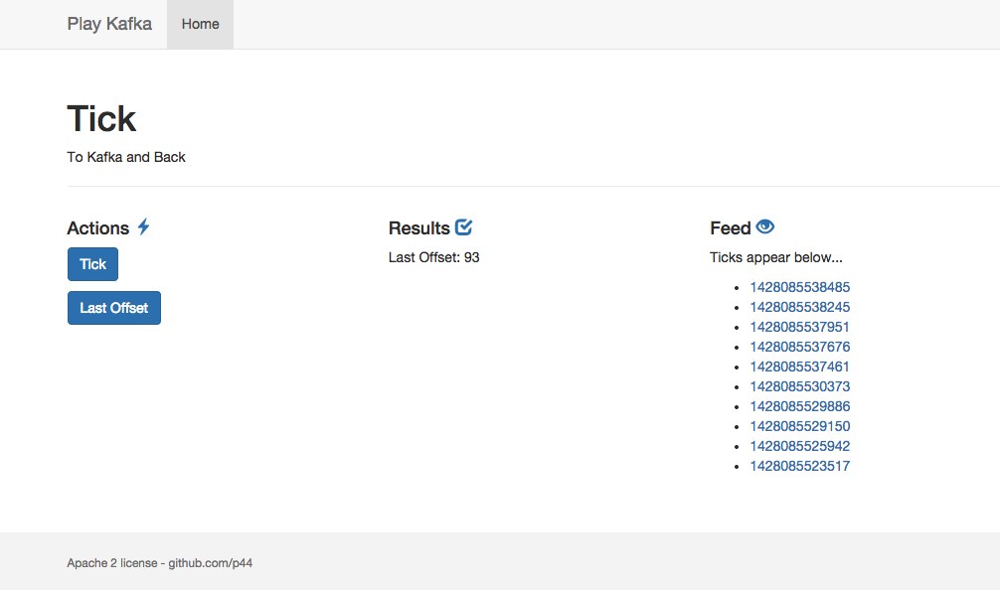

Play-Kafka (In Progress)
=========
Playframework -  Simple Kafka Example
**[Apache Kafka Home](http://kafka.apache.org/)**

This example uses
--------------

* Scala 2.11.1
* Playframework 2.3.8
* Kafka 2.11_0.8.2.1
* Bootstrap 3.3.2
* AngularJs 1.2.18

About
--------------

What tha app does.  

* Click a button to PUT action that captures the current server timestamp
* The timestamp is captured in a json block that is produced to a kafka topic
* The json is consumed from the kafka topic and broadcasted by iteratee chanel
* The UI displays a feed of consumed timestamps from the kafka topic

Screenshot

Kafka Settings
--------------
This application depends upon a running instance of kafka

The server settings and topic name is pulled from application.conf

You can use whatever Kafka server setup you chose.

The simplest way is to follow the **[Kafka Quick Start](http://kafka.apache.org/documentation.html#quickstart)**

* bin/zookeeper-server-start.sh config/zookeeper.properties
* bin/kafka-server-start.sh config/server.properties

Then create the topic that you set in the config file.  By default it is "tick"

* bin/kafka-topics.sh --create --zookeeper localhost:2181 --replication-factor 1 --partitions 1 --topic tick

License
--------------
This application is provided under the Apache 2 License

